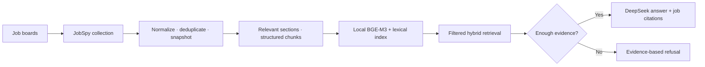

<div align="center">

<h1>JobRAG</h1>

<h3>Explore what employers ask for—with evidence from real job postings.</h3>

<p>JobRAG turns scraped job descriptions into a private, searchable knowledge base for job-market research.</p>

<p><a href="README.zh-CN.md">简体中文</a> · <strong>English</strong></p>

<p>
  
  
  
  
</p>

<p><a href="#features">Features</a> · <a href="#architecture">Architecture</a> · <a href="#quick-start">Quick Start</a> · <a href="#evaluation">Evaluation</a> · <a href="#upstream-project-and-license">Upstream &amp; License</a></p>

</div>

---

<p align="center">
  
  <br />
  <sub>Current application UI (Chinese): job search, question filters, and daily update controls.</sub>
</p>

## Architecture



## Features

| | Capability | What it does |
|:--:|---|---|
| 🔎 | **Job collection** | Search supported job boards through JobSpy and the local web UI; deduplicate postings and keep content snapshots. |
| 🧩 | **Role-aware indexing** | Keep relevant description sections—responsibilities, qualifications, skills, experience, education, and projects—and chunk along the source structure. |
| 🧠 | **Local embeddings** | Run `BAAI/bge-m3` locally; no embedding API key is needed. The model is cached under `data/models/`. |
| ⚖️ | **Hybrid retrieval** | Combine vector and lexical search (SQLite FTS5/BM25 by default), apply job filters, and assemble evidence at the job level. PostgreSQL + pgvector is also supported. |
| 💬 | **Evidence-grounded answers** | Optionally use DeepSeek to answer with job citations, or refuse when evidence is insufficient. |
| 📈 | **Quality & operations** | Evaluate retrieval and answers; use versioned caching, request/token metrics, 60-day job lifecycle management, and embedding failure recovery. |
| 🔄 | **Daily updates** | Collect up to 10 postings per source at 09:00 Singapore time and index up to 100 chunks per run. The local service must be running. Embedding failures are retried up to three times before manual recovery is offered. |

## Quick start

Requirements: Python 3.11 and [uv](https://docs.astral.sh/uv/).

```bash
./run.sh
```

Open <http://127.0.0.1:8000>. The script creates `.venv` and installs the application dependencies on first run. The default local development database is SQLite at `data/jobrag.db`.

Open **RAG Knowledge Base**, run a search to collect postings, then click **生成本地向量** (Generate local embeddings). The first embedding run downloads BGE-M3 and may take a while. To ask questions with generated answers, add your DeepSeek key to `.env` and restart the service:

```dotenv
DEEPSEEK_API_KEY=your-key
DEEPSEEK_MODEL=deepseek-v4-flash
```

Never commit `.env`. Local scraping, storage, and BGE-M3 embedding do not require a DeepSeek key.

## Evaluation and design

- [Business design and implementation guidance](docs/jobrag_business_design.md)
- [Evaluation datasets and reports](data/eval/README.md)

The evaluation workflow covers retrieval relevance, answer grounding and citations, relevance, completeness, refusal behavior, and operational signals. Evaluation reports are development artifacts, not a claim of production-level quality.

## PostgreSQL option

SQLite is the zero-setup default. To run PostgreSQL with pgvector locally, start the provided service, set `DATABASE_URL` in `.env` to the PostgreSQL URL shown in `.env.example`, apply migrations, and start JobRAG:

```bash
cp .env.example .env
docker compose up -d postgres
# Set DATABASE_URL in .env to the PostgreSQL URL from .env.example.
.venv/bin/alembic upgrade head
./run.sh
```

## Upstream project and license

JobRAG is built in this repository on the **JobSpy** codebase; JobSpy provides the underlying job-board collection components. This repository retains the upstream project history and its MIT license. See the [JobSpy project](https://github.com/speedyapply/JobSpy) for its original scraper documentation and attribution; see [LICENSE](LICENSE) for license terms.

## Current scope

JobRAG is designed for personal use and controlled testing. The scheduled collector runs inside the local web-service process, so the computer and service need to remain on for the scheduled run. Public deployment still requires additional authentication, HTTPS, backup/recovery, and production operations work.
