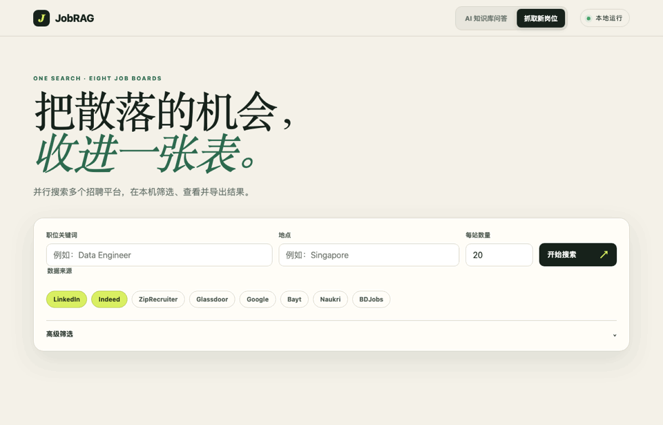
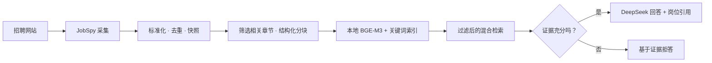

<div align="center">

<h1>JobRAG</h1>

<h3>从真实岗位描述中，看清雇主真正要求什么。</h3>

<p>JobRAG 将采集到的岗位描述构建成私有、可检索的知识库，帮助求职者研究目标岗位的市场要求。</p>

<p><strong>简体中文</strong> · <a href="README.md">English</a></p>

<p>
  
  
  
  
</p>

<p><a href="#主要功能">核心功能</a> · <a href="#系统架构">系统架构</a> · <a href="#快速开始">快速开始</a> · <a href="#评估与设计文档">评估</a> · <a href="#上游项目与许可">上游与许可</a></p>

</div>

---

<p align="center">
  
  <br />
  <sub>当前中文界面演示：岗位搜索、问答筛选和每日知识库更新设置。</sub>
</p>

## 系统架构



## 主要功能

| | 能力 | 说明 |
|:--:|---|---|
| 🔎 | **岗位采集** | 通过 JobSpy 和本地网页界面搜索招聘网站；对结果去重并保存岗位快照。 |
| 🧩 | **岗位结构化索引** | 保留职责、任职要求、技能、经验、教育和项目等章节，并按原文结构分块。 |
| 🧠 | **本地向量模型** | 本地运行 `BAAI/bge-m3`，不需要 Embedding API Key；模型缓存在 `data/models/`。 |
| ⚖️ | **混合检索** | 默认结合向量检索与关键词检索（SQLite FTS5/BM25），支持岗位过滤并在岗位级整合证据；也支持 PostgreSQL + pgvector。 |
| 💬 | **证据型回答** | 可选使用 DeepSeek 根据岗位证据生成带引用的回答；证据不足时拒答。 |
| 📈 | **质量与维护** | 评估检索和回答质量，并提供版本化缓存、请求/Token 指标、60 天岗位生命周期管理和 Embedding 失败恢复。 |
| 🔄 | **每日更新** | 新加坡时间 09:00 自动采集，每个来源最多 10 个岗位，每次最多处理 100 个片段。服务需保持运行；Embedding 失败最多自动重试 3 次，之后提供手动恢复入口。 |

## 快速开始

需要 Python 3.11 和 [uv](https://docs.astral.sh/uv/)。

```bash
./run.sh
```

打开 <http://127.0.0.1:8000>。首次运行时脚本会创建 `.venv` 并安装依赖。默认使用本地 SQLite 数据库 `data/jobrag.db`。

进入 **RAG 知识库**，先搜索并采集岗位，然后点击 **生成本地向量**。首次运行会下载 BGE-M3，耗时可能较长。若要启用自然语言问答，在 `.env` 中配置 DeepSeek Key 并重启服务：

```dotenv
DEEPSEEK_API_KEY=your-key
DEEPSEEK_MODEL=deepseek-v4-flash
```

不要提交 `.env`。本地采集、数据保存和 BGE-M3 向量生成均不需要 DeepSeek Key。

## 评估与设计文档

- [JobRAG 业务设计与实现指导](docs/jobrag_business_design.md)
- [评估数据集与报告说明](data/eval/README.md)

评估流程覆盖检索相关性、回答依据与引用、切题度、完整度、拒答行为和运行指标。评估报告用于开发迭代，不代表系统已达到生产级质量。

## PostgreSQL 选项

SQLite 是免配置的默认选项。如需本地使用 PostgreSQL + pgvector，可启动项目提供的数据库服务，在 `.env` 中将 `DATABASE_URL` 设为 `.env.example` 中的 PostgreSQL 地址，执行迁移后启动 JobRAG：

```bash
cp .env.example .env
docker compose up -d postgres
# 将 .env 中的 DATABASE_URL 设置为 .env.example 里的 PostgreSQL 地址。
.venv/bin/alembic upgrade head
./run.sh
```

## 上游项目与许可

JobRAG 是基于本仓库中的 **JobSpy** 代码库构建的，JobSpy 提供底层招聘网站采集组件。本仓库保留了上游项目历史及其 MIT 许可。上游爬虫的原始使用文档和归属信息请参阅 [JobSpy 项目](https://github.com/speedyapply/JobSpy)；许可条款见 [LICENSE](LICENSE)。

## 当前范围

JobRAG 当前面向个人使用和受控测试。定时采集运行在本地 Web 服务进程中，因此需要电脑和服务保持运行。若要公开部署，还需补充认证、HTTPS、备份恢复和生产运行保障。
